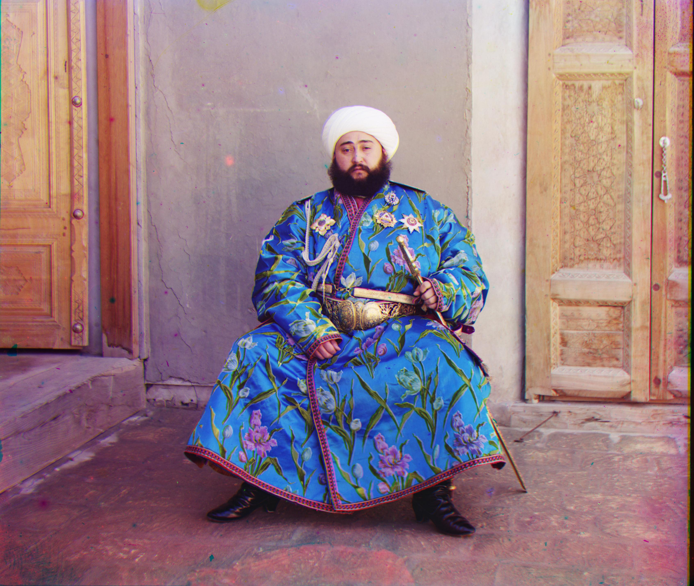
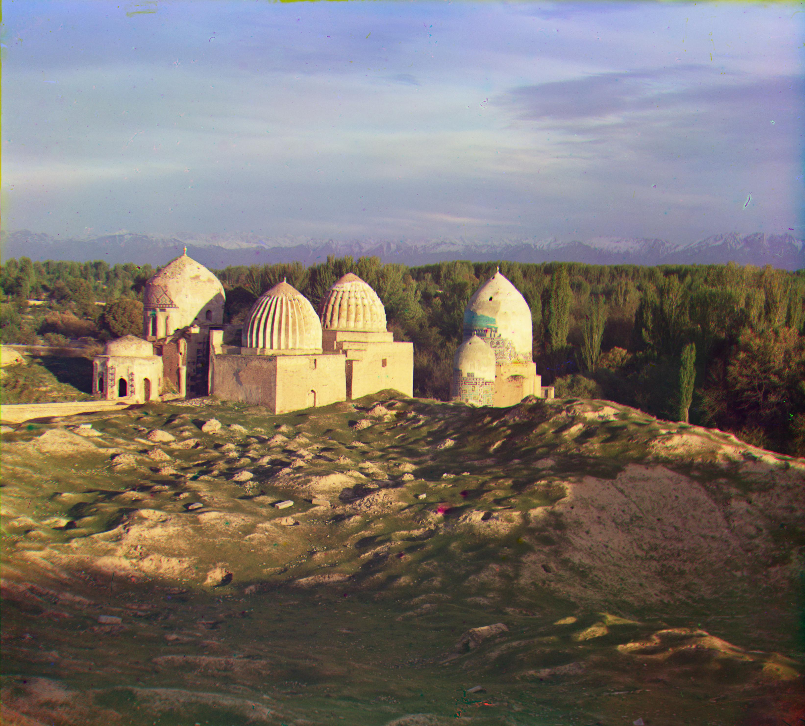

# Prokudin-Gorskii-Images

In 1955, a Scottish scientist named James Clerk Maxwell introduced a method for color imaging. This method uses three filters, each in one of the three main colors red, green, and blue. They are sensitive. Each of these filters records the brightness of one of the three primary colors. Then, combining these Three colors can recreate a color image. in this project, our goal was to write a program that gives us colored images from digitized images. 

For watching these images follow these links:

https://tile.loc.gov/storage-services/master/pnp/prok/01800/01886a.tif

https://tile.loc.gov/storage-services/master/pnp/prok/01800/01833a.tif

https://tile.loc.gov/storage-services/master/pnp/prok/00400/00458a.tif

You can see the results of this project in the following figures:

